# PartiMo

App Android nativa (Kotlin) per organizzare viaggi in modo intelligente in qualunque città del mondo.
All'avvio chiede "Dove vuoi andare?": si cerca una città oppure si tocca **Consigliami** per ricevere
le mete più adatte al periodo scelto. Il **punto di partenza** lo decide l'utente (città e aeroporto)
e il periodo può essere "Prossimi giorni", **uno qualunque dei prossimi dodici mesi** oppure **date esatte**:
sotto i mesi ci sono le celle **Andata** e **Ritorno**, che aprono il calendario (fino a un anno avanti,
al massimo 14 notti). Con le date esatte voli, alloggi, eventi, meteo, budget e itinerario usano quei giorni.

La meta scelta apre una dashboard divisa in sezioni, ognuna con il suo pulsante nella barra in basso:
**Voli**, **Alloggi**, **Da vedere**, **Trasporti**, **Ristoranti**. Il pulsante **Aggiorna** cerca le
offerte last minute ignorando la cache. La **campanella** attiva gli avvisi: PartiMo controlla i prezzi
in background e manda una notifica quando voli o alloggi diventano davvero convenienti.

In **Da vedere** i luoghi e le foto sono **reali anche senza nessuna chiave API** (arrivano da
Wikipedia). Toccando un luogo si apre la sua **scheda**: foto, breve descrizione, storia del luogo
divisa in capitoli e, sempre visibile in basso, il pulsante **Naviga** che apre Google Maps con il
percorso dalla posizione attuale fino al luogo.

In cima a **Da vedere** ci sono gli **eventi durante il soggiorno**, anche questi senza chiavi:
mercatini di Natale, festival e ricorrenze della città (da Wikidata) e festività nazionali (da
Nager.Date), solo quelli che cadono tra arrivo e partenza. Gli eventi con un luogo si aprono come gli
altri luoghi, con storia e Naviga. Nel periodo dei mercatini c'è anche il pulsante «Mercatini di Natale
a …» (Google Maps), e sempre «Tutti gli eventi di quei giorni» (ricerca Google con le date).

Anche **alloggi** e **ristoranti** sono reali senza chiavi: le strutture ricettive e i locali attorno
al centro arrivano da **OpenStreetMap**. Ogni struttura ha **Vedi prezzi**, che apre Booking.com con
nome e date del viaggio già compilati; ogni ristorante si apre su Google Maps con recensioni, foto e
orari. Per **voli** e **trasporti** i prezzi e gli orari reali richiedono una chiave: senza chiave
l'app mostra delle stime e i pulsanti verso **Google Voli**, **Skyscanner** e **Google Maps** (percorso
con i mezzi), che si aprono con tratta e date del viaggio. I siti si aprono nel **browser interno** di
PartiMo, senza uscire dall'app; le pagine di Google Maps nell'app Maps.

Con il token gratuito di **Travelpayouts** la sezione **Voli** mostra i **prezzi reali** trovati negli
ultimi giorni su **Aviasales** per **tutto il mese scelto** (o la prossima settimana; con le date esatte
prima i voli di quei giorni, segnati con «📅 Nelle tue date», poi quelli fino a tre giorni prima o dopo
con un soggiorno simile, se costano meno): compagnia con il
logo, date e orari di andata e ritorno, scali, notti sul posto e giorno in cui è stato trovato il prezzo,
cercando in tutti gli aeroporti della città (Milano comprende Bergamo, Londra anche Stansted). Ogni volo
si apre su Aviasales per verificare il prezzo e prenotare; la campanella segue il volo più conveniente
del periodo.

Il pulsante **Guida**, sotto i mesi della dashboard, apre tutto ciò che serve sapere prima di partire,
senza chiavi:
- **meteo per le date del viaggio**: previsioni giorno per giorno se si parte entro due settimane,
  altrimenti il clima tipico di quei giorni (media di dieci anni di dati misurati); **alba, tramonto e
  ora d'oro** per le foto, calcolati sul telefono;
- **in breve**: lingua, valuta, prefisso, lato di guida, fuso orario e **prese elettriche** (con
  l'avviso se serve un adattatore o se la tensione è bassa);
- **numeri di emergenza** da comporre con un tocco e la scheda del paese su **Viaggiare Sicuri**
  (Farnesina) per documenti e sicurezza;
- **convertitore di valuta** con il cambio del giorno;
- la **guida di Wikivoyage** della città (come arrivare, come muoversi, dove mangiare, sicurezza…).

I ristoranti mostrano anche gli **orari di apertura** della settimana del viaggio (e «aperto ora» per
i viaggi imminenti) e, come gli alloggi, l'**accessibilità in carrozzina**, da OpenStreetMap.

Con una chiave gratuita di **Google Gemini** si attiva l'**assistente con l'IA**, raggiungibile dai
pulsanti sotto i mesi della dashboard:
- **Itinerario con l'IA:** il programma giorno per giorno del viaggio, costruito con i luoghi e gli
  eventi reali di Da vedere (più qualche locale tipico consigliato dall'IA), secondo il ritmo e gli
  interessi scelti. Ogni giornata ha il **giro a piedi** su Google Maps con le tappe in ordine e si può
  aggiungere al **calendario**; c'è la **lista per la valigia** da spuntare (resta salvata) e ci sono i
  **consigli** pratici (mance, trasporti, usanze). L'itinerario si condivide come testo e si rigenera
  con un tocco.
- **Chiedi a PartiMo:** domande libere sul viaggio («Cosa mangio a Vienna?», «Come arrivo in centro
  dall'aeroporto?»), con le risposte che tengono conto di città, date ed eventi del soggiorno.

La **stella ☆** su luoghi, eventi, ristoranti e alloggi li salva tra i **preferiti** del viaggio e il
**cuore** in alto salva il viaggio stesso: i viaggi salvati compaiono nella schermata iniziale sotto
«I tuoi viaggi», con il conto alla rovescia. La schermata dei preferiti li raccoglie per tipo, con la
mappa, il **giro a piedi** tra i preferiti su Google Maps e la condivisione dell'elenco.

La **🗺️ Mappa** mostra tutti i punti del viaggio (luoghi, eventi, ristoranti e alloggi, con colori
diversi) su una mappa vettoriale vera, senza chiavi: [OpenFreeMap](https://openfreemap.org) con i dati
di OpenStreetMap, disegnata da [MapLibre](https://maplibre.org). I filtri fanno da legenda, «Solo
preferiti» lascia i punti salvati e il tocco su un punto apre la sua scheda con «Naviga».

Il **🗣️ Traduttore** propone la lingua del posto (es. il tedesco a Vienna) e, dopo aver scaricato una
volta il pacchetto lingua, **traduce anche senza Internet** sul telefono (ML Kit di Google, gratuito).
La traduzione si **ascolta** con la voce del telefono, si copia o si **mostra in grande** a chi si ha
davanti; le lingue si invertono per tradurre cartelli e menù. C'è un **frasario** pronto (ristorante,
spostamenti, albergo, acquisti, emergenze) e la scorciatoia a Google Traduttore per fotocamera e
conversazione.

Altri strumenti del viaggio, tutti senza chiavi:
- **🧭 Come arrivare** (in Trasporti): treni, pullman e voli dalla città di partenza su Google Maps e
  Rome2rio, con le **emissioni di CO₂** a persona di aereo, treno, pullman e auto (fattori ufficiali
  DESNZ 2025).
- **🎟️ Biglietti** per musei e attrazioni su Tiqets, sia per la città sia dalla scheda di un museo.
- **💶 Budget**: spese nella valuta in cui si pagano, totali in euro con i cambi del giorno, spese
  per categoria e tetto di spesa con quanto resta.
- **🎫 Le mie prenotazioni**: voli, alloggi, treni e biglietti in una linea del tempo, anche senza rete.
  Si aggiungono incollando la mail di conferma o scegliendo il PDF o lo screenshot del biglietto (anche con
  **Condividi → PartiMo**): date, orari, aeroporti e codice si leggono sul telefono. Promemoria per il
  check-in online, per andare in aeroporto e per treni e attività in partenza.
- **Promemoria** una settimana prima e il giorno prima della partenza dei viaggi salvati e
  **preparazione offline**: con il Wi-Fi i viaggi salvati che partono entro un mese scaricano luoghi,
  eventi, ristoranti, alloggi, guida, meteo, cambio e foto, così l'app funziona anche senza rete.
- **📍 Dove sono** sulla mappa, con la distanza dal punto scelto (la posizione resta sul telefono).
- Widget **Prossimo viaggio** per la schermata Home, con il conto alla rovescia.
- **Fonti, licenze e privacy** (ⓘ nella schermata iniziale).

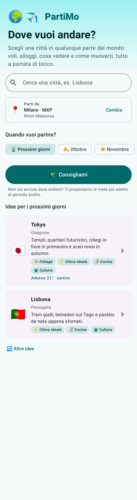 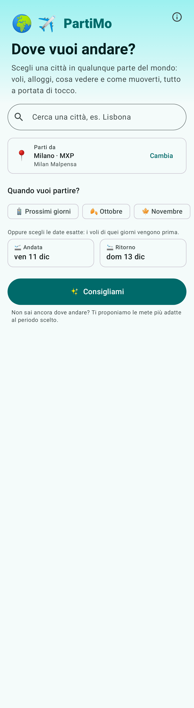 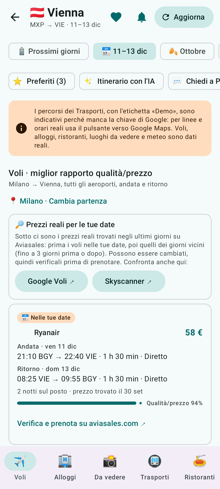 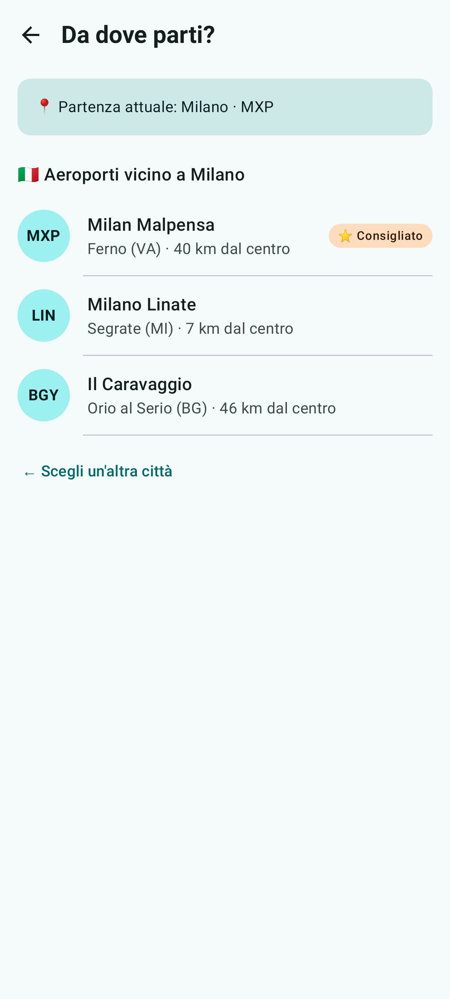 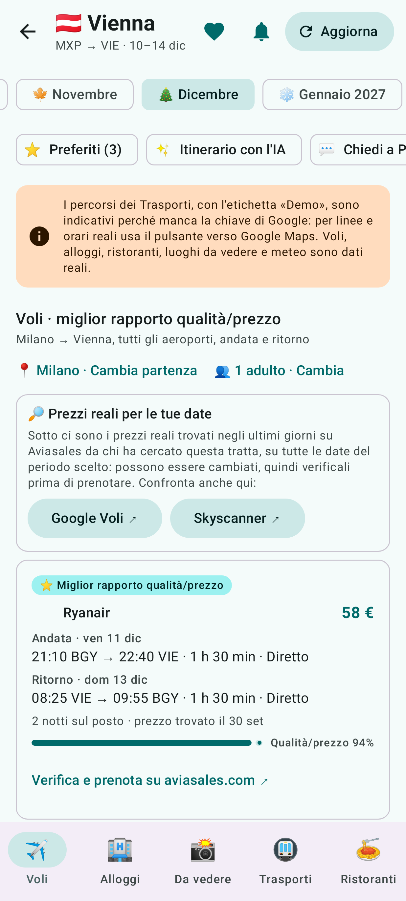 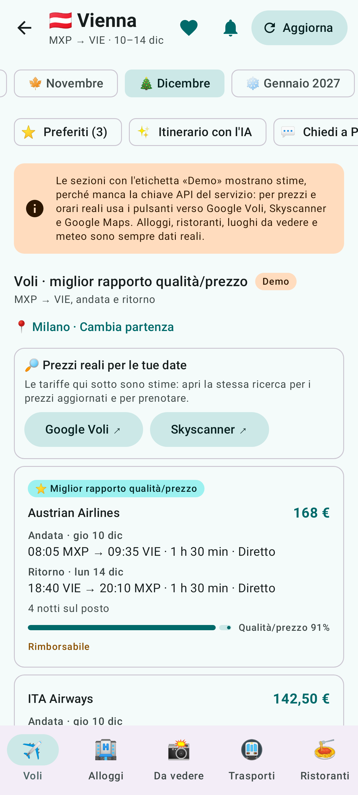 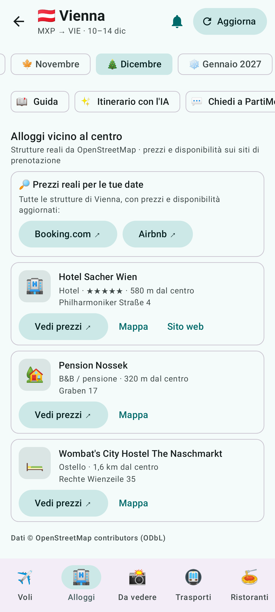 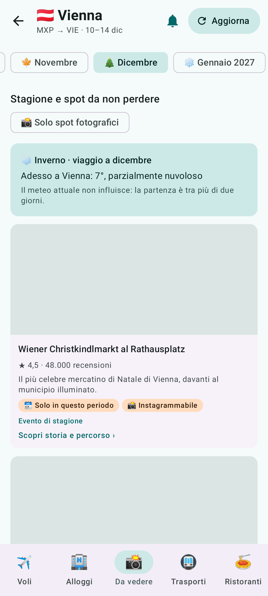 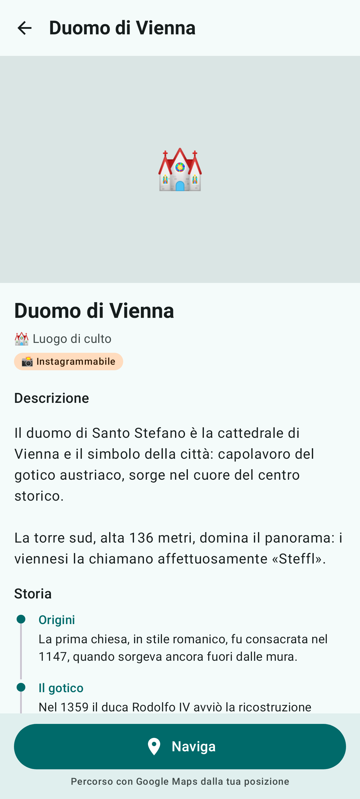 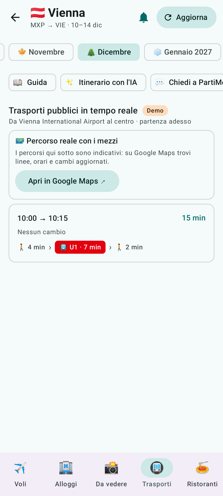 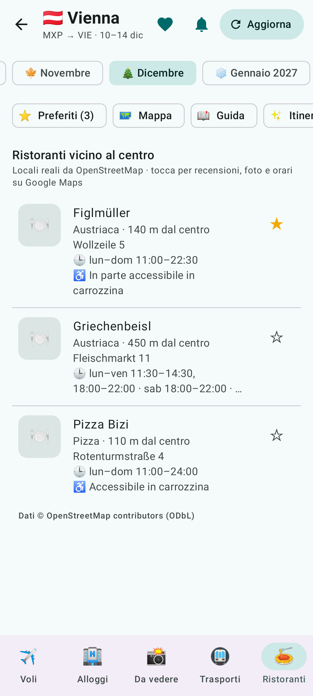 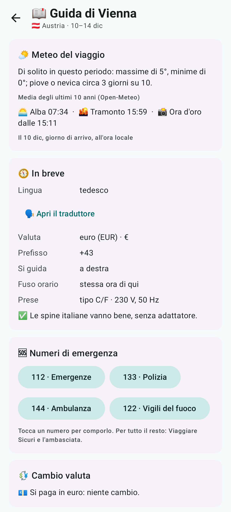 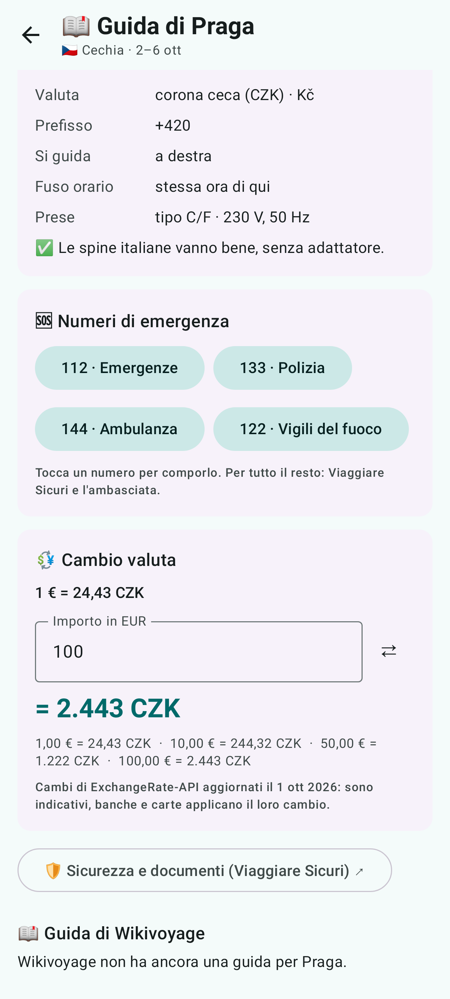 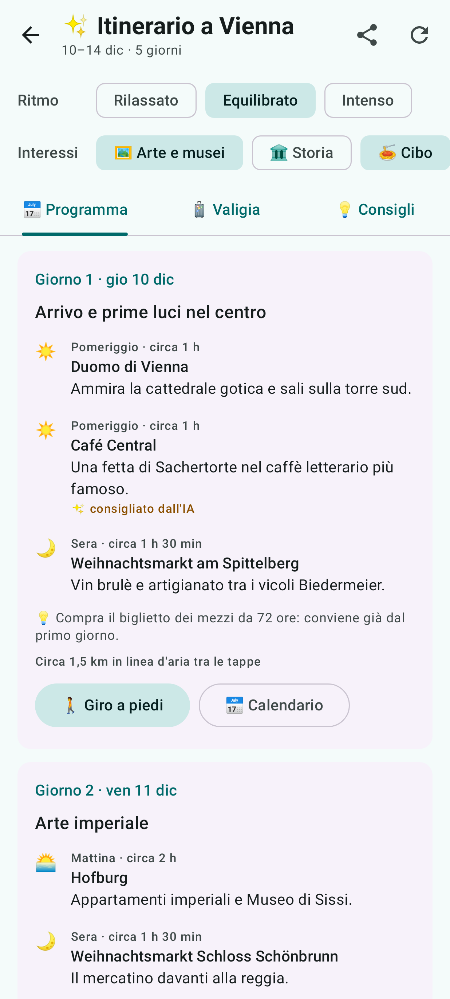 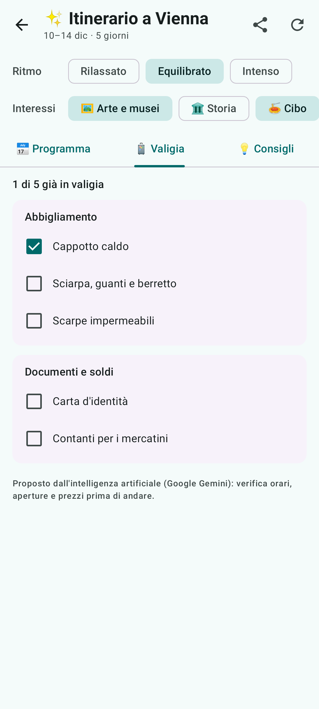   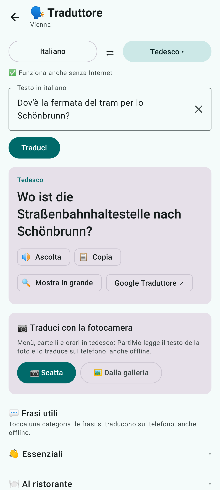 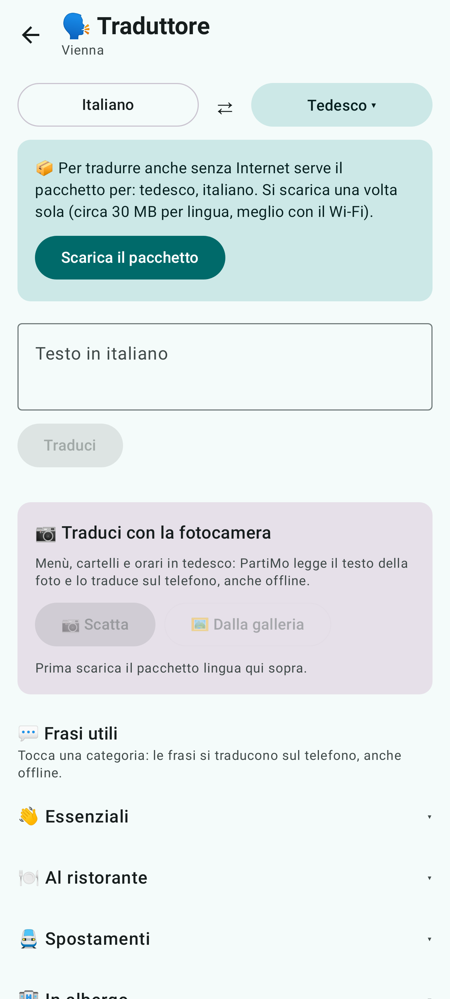 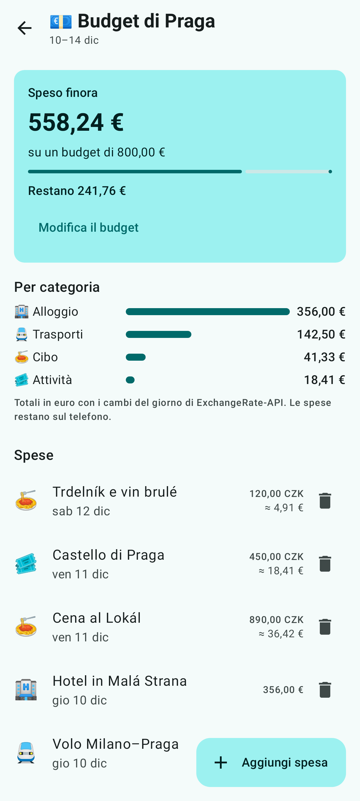 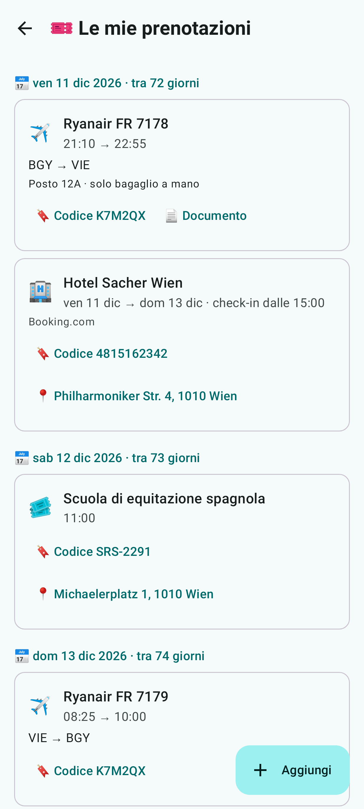 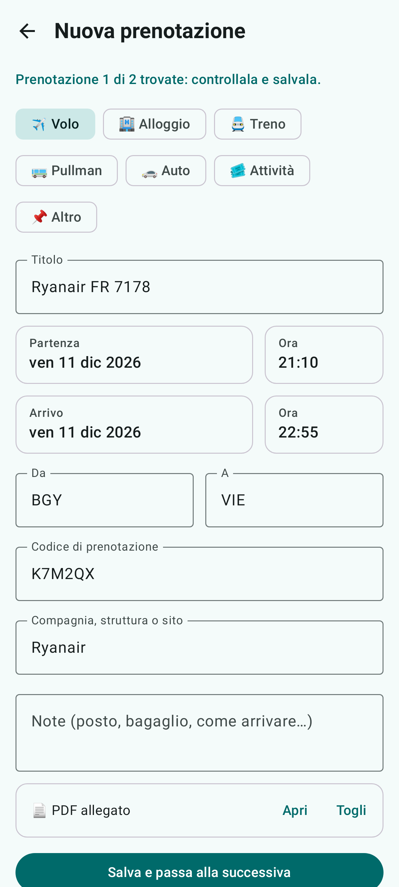 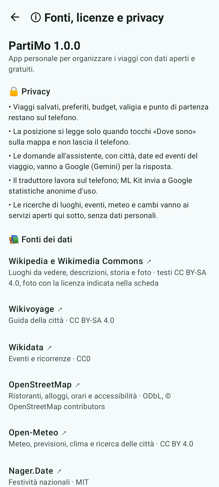

Negli screenshot (generati dai test, senza rete, con dati di esempio) le foto sono segnaposto grigi: nell'app si caricano
le foto reali dei luoghi. La mappa non è tra gli screenshot: i test girano sulla JVM, dove la libreria
nativa della mappa non c'è.

## Stack

| Area | Tecnologia |
|---|---|
| Linguaggio | Kotlin 2.3.21 (Kotlin integrato in AGP 9) |
| UI | Jetpack Compose (BOM 2026.06.01) + Material 3 |
| Architettura | Clean Architecture a moduli (`:domain`, `:data`, `:app`) + MVVM |
| Asincronia | Coroutines, `StateFlow` / `Flow` |
| Rete | Ktor Client 3.5 (motore OkHttp) + kotlinx.serialization |
| Cache locale | Room 2.8 (KSP) |
| Preferenze | DataStore Preferences 1.2 (punto di partenza, viaggi seguiti) |
| Lavori in background | WorkManager 2.12 (controllo periodico delle offerte) + notifiche |
| Immagini | Coil 3 |
| Intelligenza artificiale | [Google Gemini API](https://ai.google.dev/gemini-api/docs) (REST, livello gratuito), risposte JSON con schema |
| Build | Gradle 9.5.1, AGP 9.3.3, version catalog, `compileSdk`/`targetSdk` 36, `minSdk` 26 |
| Navigazione | Navigation Compose 2.9 con rotte type-safe (`@Serializable`) |
| Test | JUnit 4 + kotlin.test, kotlinx-coroutines-test, Turbine, Ktor MockEngine, Robolectric + Compose UI test |

## Architettura

```
┌─────────────────────────────── :app (presentation) ────────────────────────────────┐
│ NavHost: Search → Dashboard (5 sezioni) → Scheda del luogo · Scelta partenza        │
│          Dashboard → Itinerario con l'IA · Chiedi a PartiMo                         │
│            ▲ StateFlow<…UiState> (schermate stateless)                              │
│ SearchVM · TripDashboardVM · PlaceDetailVM · DeparturePickerVM                      │
│ ItineraryVM · ChatVM ─────────────────────────────────────────────── AppContainer   │
│ DealCheckWorker (WorkManager) → DealNotifier (notifiche, apertura del viaggio)      │
└──────────────────────────────────────┬──────────────────────────────────────────────┘
                                       │ casi d'uso
┌─────────────────────────────── :domain (Kotlin puro) ──────────────────────────────┐
│ UseCase → servizi (qualità/prezzo, stagionalità, tag foto, aeroporti, affari)        │
│        → interfacce Repository · modelli (TravelPeriod, PriceWatch…) · DataResult    │
└──────────────────────────────────────▲──────────────────────────────────────────────┘
                                       │ implementa
┌───────────────────────────── :data (Android library) ──────────────────────────────┐
│ DefaultXxxRepository (safeApiCall: eccezioni → DataError, Dispatchers.IO)            │
│   → DataSource: provider reale (Ktor + ResponseCache/Room) oppure demo               │
│ Wikipedia (luoghi) · OpenStreetMap (alloggi, ristoranti) · DataStore · DataModule    │
│ Gemini (itinerari, domande: più modelli in cascata, risposte JSON con schema)        │
└─────────────────────────────────────────────────────────────────────────────────────┘
```

- **`:domain`** è un modulo JVM puro: nessuna dipendenza da Android, rete o database. Contiene i
  modelli, le interfacce dei repository, i casi d'uso e la logica di business testabile.
- **`:data`** implementa i repository. Ogni provider è dietro un'interfaccia `DataSource`, quindi
  cambiare provider (ad esempio passare da un'API al proprio backend) richiede una sola classe.
- **`:app`** contiene Compose, i ViewModel, le notifiche e la *composition root*: l'unico punto che
  conosce la configurazione (`BuildConfig`).
- Gli errori non attraversano i layer come eccezioni: i repository restituiscono
  `DataResult.Success(data, origin)` oppure `DataResult.Failure(DataError)`. La UI li traduce in
  `UiState` `Loading` / `Success` / `Empty` / `Error`.

## Funzionalità

| Modulo | Dominio | Provider reale | Note |
|---|---|---|---|
| Ricerca mete nel mondo | `SearchCitiesUseCase`, `ResolveDestinationUseCase`, `AirportSelector` | [Open-Meteo Geocoding](https://open-meteo.com/en/docs/geocoding-api) (gratuito, senza chiave) + dataset aeroporti [OurAirports](https://ourairports.com/data/) | Ricerca con debounce e nomi in italiano; scelta automatica dell'aeroporto di arrivo (hub internazionale > grande > più vicino) |
| Punto di partenza | `FindDepartureAirportsUseCase`, `ObserveDepartureUseCase`, `SaveDepartureUseCase` | Geocoding + aeroporti, salvato con DataStore | L'utente cerca la sua città e sceglie l'aeroporto: il consigliato è in cima, ma può preferirne un altro (es. Linate invece di Malpensa). Cambiandolo, i voli si ricaricano da soli |
| Periodo del viaggio | `TravelPeriod`, `FlexibleDates` | – | "Prossimi giorni" + i dodici mesi successivi: ogni mese dell'anno è selezionabile, sia nella ricerca sia nella dashboard. In più le **date esatte** (`TravelPeriod.Dates`) scelte nelle celle Andata e Ritorno con il calendario di Material 3: valgono per tutta la dashboard, i promemoria e gli avvisi |
| Chi parte | `Travellers`, `ObserveTravellersUseCase`, `SaveTravellersUseCase` | Salvato con DataStore (e nel backup) | Adulti e bambini con l'età di ognuno (al massimo 9 persone, come sui siti dei voli; ogni neonato in braccio a un adulto diverso), scelti nella schermata iniziale o dai voli della dashboard. Valgono per tutto: prezzi dei voli per tutti i posti con il prezzo a persona (i neonati viaggiano in braccio), ricerca alloggi con una camera ogni due adulti, Skyscanner con le età dei bambini, Booking con età e camere, Airbnb con bambini e neonati, Aviasales con adulti, bambini (2–11 anni) e neonati, CO₂ dell'auto divisa tra i viaggiatori, budget con la spesa a testa e assistente con l'IA che sa se ci sono bambini. Gli avvisi seguono il prezzo di un posto |
| Consigliami | `RecommendDestinationsUseCase` | Catalogo curato di ~50 mete + meteo attuale | Mete adatte al mese del viaggio: mercatini, aurora boreale, fioriture, foliage, mare, clima ideale |
| Voli | `SearchFlightsUseCase`, `ValueForMoneyScorer`, `FlightSearchQuery.matchesDates` | [Aviasales Data API](https://support.travelpayouts.com/hc/en-us/articles/203956163-Aviasales-Data-API) (Travelpayouts, token gratuito) oppure [Duffel](https://duffel.com/docs) (offer requests) | Con Travelpayouts: prezzi reali trovati di recente per tutte le partenze del mese scelto (o dei prossimi sette giorni) con soggiorni da 2 a 7 notti, cercando per città (codici e fusi orari degli aeroporti e nomi delle compagnie inclusi nell'app, dai dati di Travelpayouts), orari locali calcolati con il fuso di ogni aeroporto (anche al cambio dell'ora), giorno in cui è stato trovato il prezzo e pagina del volo su Aviasales. Punteggio qualità/prezzo normalizzato. Sempre presenti i pulsanti **Google Voli** e **Skyscanner** con tratta e date compilate: senza chiavi le tariffe mostrate sono stime e i pulsanti portano ai prezzi reali |
| Alloggi | `SearchAccommodationsUseCase`, `FindLodgingsUseCase` | Duffel Stays, oppure senza chiave [OpenStreetMap](https://www.openstreetmap.org) ([Overpass API](https://wiki.openstreetmap.org/wiki/Overpass_API)) | Con Duffel: offerte con prezzo, media bayesiana sulle recensioni, filtri e ordinamenti. Senza chiave: hotel, B&B, ostelli e appartamenti reali vicino al centro (tipo, stelle, indirizzo, distanza), ognuno con **Vedi prezzi** (Booking.com con nome e date), mappa e sito ufficiale; in alto Booking.com e Airbnb per tutta la città |
| Quando e dove conviene | `GetMonthPricesUseCase`, `GetPriceCalendarUseCase`, `FindCheapDestinationsUseCase`, `FareLevel`, `AnywhereQuery` | [Aviasales Data API](https://support.travelpayouts.com/hc/en-us/articles/203956163-Aviasales-Data-API) (`grouped_prices` per mese e per giorno, `prices_for_dates` senza destinazione), nomi delle città in italiano inclusi nell'app | Con il token di Travelpayouts: sui chip dei mesi della dashboard il prezzo più basso a persona di andata e ritorno (2–7 notti), con il mese più conveniente in verde; **calendario dei prezzi** con il prezzo di ogni giorno di partenza colorato per fascia (terzo più economico in verde, più caro in rosso), mese per mese, e un tocco su un giorno porta le date della sua tariffa nella dashboard (con le date scelte valgono le loro notti); **Ovunque** nella schermata iniziale: le mete più economiche dalla città di partenza per il periodo scelto (prossimi giorni, mese o date esatte), una per città, con date, notti, scali e filtro fino a 50, 100 o 200 €; un tocco apre la dashboard della meta sulle date del volo |
| Aggiorna (last minute) | `TripDashboardViewModel.refresh`, `PriceChange` | – | Ricarica tutto ignorando la cache e riassume la variazione dei prezzi migliori (es. "🔥 Volo sceso a 89 € (−12 €)") |
| Avvisi sulle offerte | `SetPriceAlertUseCase`, `CheckPriceWatchesUseCase`, `DealDetector` | WorkManager + notifiche | Controllo ogni 6 ore con rete disponibile; notifica se volo o alloggio (ben recensito) costa almeno il 15% in meno del solito; tocco sulla notifica → dashboard del viaggio |
| Da vedere (esplorazione stagionale) | `GetSeasonalHighlightsUseCase`, `SeasonalPoiFilter`, `SeasonalCalendar`, `PhotoSpotTagger` | [Wikipedia](https://www.mediawiki.org/wiki/API:Main_page) (gratuita, senza chiave) oppure Google Places API (New), + [Open-Meteo](https://open-meteo.com) | Senza chiave: luoghi e foto reali da Wikipedia, dal più noto al meno noto, senza città, enti, stazioni, eventi storici ed edifici scomparsi. Con la chiave Google anche valutazioni e temi del mese (es. mercatini di Natale a dicembre). Stagioni invertite nell'emisfero sud, tag Instagrammabile/Panoramico/Tramonto/Chicca nascosta |
| Eventi durante il soggiorno | `GetTripEventsUseCase`, `EventTiming`, `SeasonalCalendar` | [Wikidata](https://www.wikidata.org) (SPARQL, gratuito, senza chiave) + [Nager.Date](https://date.nager.at) (festività, gratuito, senza chiave) | Mercatini di Natale, festival e ricorrenze entro 15 km dal centro, con il loro mese (es. Oktoberfest a settembre–ottobre) o giorno (concerto di Capodanno il 1° gennaio); per i mercatini senza date vale il periodo tipico (15 novembre–24 dicembre). Si tengono solo gli eventi tra arrivo e partenza, più le festività nazionali con il nome italiano e quello locale (es. Immacolata Concezione · Mariä Empfängnis) |
| Scheda del luogo e "Naviga" | `GetPoiDetailsUseCase`, `Excerpt` | Wikipedia (testo, foto, crediti da Wikimedia Commons) + [Google Maps URLs](https://developers.google.com/maps/documentation/urls/get-started) | Tocco su un luogo: foto in alta risoluzione, breve descrizione, storia in capitoli (es. Costruzione → Medioevo → restauri), fonti e licenze. **Naviga** apre l'app Google Maps (o il browser) con il percorso fino al luogo, senza chiave. Per i luoghi di Google la voce si cerca per nome vicino alle coordinate |
| Trasporti pubblici | `PlanTransitRouteUseCase`, `TransitRoute` (cambi, coincidenze, tempo a piedi) | Google Routes API (`TRANSIT`) + Google Maps URLs | Percorsi multimodali metro/bus/tram/treni, coincidenze impossibili scartate, preferenze di routing. **Apri in Google Maps** mostra lo stesso percorso con linee e orari reali anche senza chiave |
| Itinerario con l'IA | `PlanTripUseCase`, `LoadTripKnowledgeUseCase`, `PackingChecklistUseCase`, `TripPlan` | [Google Gemini](https://ai.google.dev/gemini-api/docs) (chiave gratuita di AI Studio) + Google Maps URLs | Programma giorno per giorno (mattina, pomeriggio, sera) con i luoghi e gli eventi reali dell'app, ritmo (rilassato, equilibrato, intenso) e interessi a scelta; tocco su una tappa → scheda del luogo o ricerca su Google Maps. **Giro a piedi** della giornata su Google Maps con le tappe in ordine (fino a 9 intermedie), **Calendario** (evento di tutto il giorno, senza permessi), **condivisione** come testo, lista per la valigia salvata sul telefono, consigli pratici |
| Chiedi a PartiMo | `AskTravelAssistantUseCase` | Google Gemini | Conversazione sul viaggio con domande suggerite; il modello riceve città, date, eventi del soggiorno e luoghi consigliati, più gli ultimi 20 messaggi. Le risposte si possono selezionare e copiare |
| Guida del viaggio | `GetCountryInfoUseCase`, `GetExchangeRateUseCase`, `GetTravelGuideUseCase` | Dati internazionali del sistema (CLDR) + catalogo curato di 80 paesi, [ExchangeRate-API](https://www.exchangerate-api.com/docs/free) (accesso aperto, senza chiave), [Wikivoyage](https://www.wikivoyage.org) (senza chiave), [Viaggiare Sicuri](https://www.viaggiaresicuri.it) | Lingua, valuta, prefisso, lato di guida, fuso orario, prese e tensione (con l'avviso adattatore), numeri di emergenza da comporre con un tocco, convertitore di valuta (oltre 160 valute), capitoli utili della guida di Wikivoyage in italiano (o in inglese se manca) e scheda del paese della Farnesina |
| Meteo per le date del viaggio | `GetTripWeatherUseCase`, `SunCalculator` | [Open-Meteo](https://open-meteo.com) previsioni giornaliere e [archivio storico](https://open-meteo.com/en/docs/historical-weather-api) (senza chiave) | Entro 16 giorni le previsioni dei giorni del viaggio; oltre, il clima tipico di quei giorni (±3) sugli ultimi dieci anni: massime, minime e giorni di pioggia o neve. Alba, tramonto e ora d'oro calcolati sul telefono (anche notte e giorno polari). Il meteo arriva anche all'assistente, per la lista della valigia |
| Orari e accessibilità | `OpeningHoursParser`, `OpeningHours`, `WheelchairAccess` | OpenStreetMap (`opening_hours`, `wheelchair`) | Orari della settimana del viaggio con i giorni uguali raggruppati (es. «lun–ven 11:30–14:30, 18:00–22:00 · dom chiuso»), «aperto ora / apre domani alle 11:00» all'ora della meta per i viaggi dei prossimi giorni, chiusure dopo mezzanotte; accessibilità in carrozzina di ristoranti e alloggi |
| Preferiti e viaggi salvati | `ToggleFavoriteUseCase`, `SetTripSavedUseCase`, `ObserveSavedTripsUseCase`, `SavedTrip`, `Favorite` | DataStore (sul telefono) | Stella su luoghi, eventi, ristoranti e alloggi (il primo preferito salva anche il viaggio), cuore per salvare il viaggio, «I tuoi viaggi» nella schermata iniziale (prima i prossimi, con il conto alla rovescia), preferiti per tipo con giro a piedi (dal primo, poi sempre il più vicino) e condivisione |
| Mappa del viaggio | `MapViewModel`, `MapPoints` | [MapLibre Native](https://maplibre.org) + [OpenFreeMap](https://openfreemap.org) (stile vettoriale gratuito, senza chiave, dati © OpenStreetMap) | Luoghi, eventi, ristoranti e alloggi del viaggio (gli stessi dati della dashboard, dalla cache) più i preferiti salvati; filtri per tipo con i conteggi, «Solo preferiti», tema chiaro e scuro, scheda del punto con «Apri la scheda», «Apri la pagina», «Naviga» e stella. Zoom e posizione restano tornando dalla scheda di un luogo |
| Come arrivare e CO₂ | `CarbonFootprint` | Google Maps URLs, [Rome2rio](https://www.rome2rio.com), fattori di conversione [DESNZ 2025](https://www.gov.uk/government/publications/greenhouse-gas-reporting-conversion-factors-2025) (OGL v3) | Treni e bus tra le città su Google Maps, tutti i mezzi su Rome2rio; CO₂e andata e ritorno a persona: aereo internazionale 0,143 kg/km con gli effetti in quota (voli sotto 500 km 0,229), treno 0,035, pullman 0,028, auto 0,167 a veicolo divisa tra i viaggiatori; percorsi via terra stimati come linea d'aria +20%, solo aereo oltre 2.000 km |
| Biglietti | `TravelLinks.tiqets` | [Tiqets](https://www.tiqets.com) (collegamenti) | Biglietti delle attrazioni della città in Da vedere; nella scheda di musei, monumenti, chiese e attrazioni il pulsante «Biglietti» apre i biglietti del luogo |
| I tuoi dati (backup) | `ExportUserDataUseCase`, `ImportUserDataUseCase`, `UserData.mergedWith` | Backup di Android (Google e passaggio a un telefono nuovo) + file JSON scelto dall'utente (Storage Access Framework) | Nella schermata «Dati, fonti e privacy»: riepilogo di cosa c'è sul telefono, **Esporta** in un file (es. su Drive o in Download, senza permessi di archiviazione) e **Importa** da un file, unendo i dati senza perderne (a parità di viaggio vince il file, preferiti, spese e voci della valigia si sommano). Il backup automatico di Android include solo il file dei dati dell'utente: cache, pacchetti lingua e mappe si riscaricano |
| Le mie prenotazioni | `BookingTextReader`, `ReadBookingTextUseCase`, `ReadBookingDocumentUseCase`, `BookingRemindersUseCase`, `BookingReminders` | DataStore (sul telefono) + [ML Kit Text Recognition v2](https://developers.google.com/ml-kit/vision/text-recognition/v2/android) (gratuito, sul telefono) + WorkManager | Voli, alloggi, treni, pullman, auto e attività in una **linea del tempo** giorno per giorno, consultabile anche senza rete (dalla dashboard solo quelle delle date del viaggio). Si **importano** incollando la mail di conferma o scegliendo il PDF, la foto o lo screenshot del biglietto, anche con **Condividi → PartiMo** da Gmail o dai Download: il testo si legge sul telefono e ne escono compagnia e numero del volo, aeroporti, date e orari (con l'arrivo il giorno dopo per i voli notturni), codice di prenotazione, check-in e check-out dell'alloggio; andata e ritorno si controllano e si salvano uno alla volta. Il documento resta allegato e si apre con un tocco, il codice si copia, l'indirizzo apre Maps. **Promemoria**: check-in online 24 ore prima e «è ora di andare in aeroporto» 3 ore prima del volo (nel fuso dell'aeroporto di partenza), un'ora prima di treni, pullman e attività, la mattina del check-in; senza orario la sera prima. Le prenotazioni sono nel backup; i documenti passano solo a un telefono nuovo |
| Budget del viaggio | `EditTripBudgetUseCase`, `SummarizeBudgetUseCase`, `TripBudget` | DataStore (sul telefono) + ExchangeRate-API | Spese in euro o nella valuta del paese, categoria, giorno e nota; totali in euro con i cambi del giorno (anche offline dalla cache, le spese senza cambio vengono segnalate), spese per categoria, tetto di spesa con quanto resta o di quanto lo si supera |
| Promemoria e uso offline | `TripRemindersUseCase`, `PrefetchTripUseCase`, `TripReminders` | WorkManager + notifiche | Promemoria una settimana prima (valido fino a due giorni prima) e il giorno prima della partenza, una volta sola; con il Wi-Fi e la batteria carica i viaggi salvati entro un mese si preparano per l'uso senza rete (dati e foto) |
| Widget e posizione | `NextTripWidget`, `rememberMyLocation` | Jetpack Glance, LocationManager di Android | Widget «Prossimo viaggio» con conto alla rovescia; sulla mappa «Dove sono» con la distanza dal punto scelto, permesso chiesto solo al tocco |
| Traduttore | `TranslateTextUseCase`, `LanguagePacksUseCase`, `TranslatorLanguages` | [ML Kit Translation](https://developers.google.com/ml-kit/language/translation) (gratuito, sul telefono) + sintesi vocale di Android | 58 lingue; lingua del posto proposta dal paese, pacchetti di circa 30 MB scaricati una volta e poi offline, inversione delle lingue, Ascolta, Copia, Mostra in grande, frasario per categorie tradotto sul telefono, scorciatoia a Google Traduttore |
| Ristoranti | `FindBudgetRestaurantsUseCase`, `BudgetDiningCriteria` | Google Places API (New), oppure senza chiave OpenStreetMap (Overpass API) | Con Google: vincolo `price_level` 1–2 e valutazione ≥ 4,3, riapplicato sempre dal dominio. Senza chiave: locali reali vicino al centro (cucina, indirizzo, distanza), prima i più completi e vicini, catene in fondo. Il tocco apre il locale su Google Maps (recensioni, foto, orari) |

### Quando un'offerta è "davvero conveniente"
Per ogni viaggio seguito PartiMo conserva lo storico dei prezzi migliori: il volo più economico e
l'alloggio con recensioni da 8/10 in su più economico (a notte). All'attivazione della campanella i
prezzi visti in quel momento diventano il primo riferimento. A ogni controllo:
- il **prezzo abituale** è la mediana degli ultimi 10 controlli (un picco isolato non la sposta);
- è un **affare** se il prezzo attuale è almeno il **15%** sotto il prezzo abituale;
- lo stesso affare non viene notificato due volte: serve un ulteriore calo del 5%, oppure che il
  prezzo torni normale e poi scenda di nuovo;
- gli avvisi di mesi ormai passati vengono rimossi; una ricerca fallita (es. offline) non altera lo storico.

### Cache delle ricerche
`ResponseCache` salva in Room le risposte (già validate) di ogni ricerca, identificate da una chiave
SHA-256 dei parametri. Il TTL dipende dal tipo di dato: offerte Duffel 20 minuti, prezzi dei voli di Aviasales 3 ore, alloggi 1 ora, ristoranti
12 ore, POI e strutture ricettive 24 ore, meteo 15 minuti, trasporti 2 minuti, ricerca città, voci di Wikipedia ed eventi
ricorrenti e guide di Wikivoyage 7 giorni, cambi 12 ore, previsioni giornaliere 3 ore, festività, clima
tipico e itinerari dell'IA 30 giorni (riaprire un itinerario non consuma la
quota gratuita di Gemini; «Rigenera» ne chiede uno nuovo). Se la rete non è
disponibile viene servito il dato scaduto, segnalato in UI con il badge "Offline · dati salvati".
**Aggiorna**, il pull-to-refresh e i controlli in background ignorano le cache ancora valide.

## Configurazione delle chiavi API

Le chiavi API sono **personali**: sono legate al tuo account (e, per Google, alla fatturazione), quindi
ognuno deve crearle per sé e **non vanno mai inserite nel codice né committate**. Chi le trovasse nel
repository potrebbe usarle a tue spese. PartiMo le legge **solo** da `local.properties` (escluso dal
VCS) oppure da variabili d'ambiente (utile in CI), e le inietta in `BuildConfig` da
`app/build.gradle.kts`.

### Cosa funziona con e senza chiavi

| Funzione | Senza chiavi | Con le chiavi |
|---|---|---|
| Da vedere: luoghi, foto, descrizione, storia | ✅ Reale (Wikipedia) | ✅ Reale (Google Places + storia da Wikipedia) |
| Eventi durante il soggiorno e festività | ✅ Reali (Wikidata, Nager.Date) + ricerca Google degli eventi | ✅ Reali, in più i temi del mese da Google Places in Da vedere |
| Naviga (Google Maps) | ✅ Reale, non serve chiave | ✅ Reale |
| Ricerca città, aeroporti, Consigliami, meteo | ✅ Reale | ✅ Reale |
| Alloggi | ✅ Strutture reali (OpenStreetMap) + Booking.com e Airbnb con le date del viaggio | Offerte con prezzo di Duffel Stays (`DUFFEL_ACCESS_TOKEN`) |
| Ristoranti | ✅ Locali reali (OpenStreetMap), tocco → Google Maps | Google Places API (`GOOGLE_MAPS_API_KEY`): valutazioni, fasce di prezzo, foto |
| Voli | Stime + ✅ Google Voli e Skyscanner con tratta e date (prezzi reali sul sito) | ✅ Prezzi reali trovati di recente su Aviasales per tutto il mese (`TRAVELPAYOUTS_TOKEN`, gratuito), oppure offerte Duffel nell'app (`DUFFEL_ACCESS_TOKEN`) |
| Trasporti pubblici | Stime + ✅ percorso reale su Google Maps | Percorsi reali nell'app, Google Routes API (`GOOGLE_MAPS_API_KEY`) |
| Guida: meteo del viaggio, paese, emergenze, valuta, Wikivoyage | ✅ Reale (Open-Meteo, dati del sistema, ExchangeRate-API, Wikivoyage) | ✅ Reale |
| Orari di apertura e accessibilità | ✅ Reali (OpenStreetMap) | Con Google Places: «aperto ora» di Google |
| Itinerario con l'IA, valigia, Chiedi a PartiMo | Non disponibili (i pulsanti non compaiono) | ✅ Google Gemini (`GEMINI_API_KEY`, gratuita) |

I dati di OpenStreetMap, Wikipedia, Wikidata, Nager.Date e Open-Meteo e i collegamenti ai siti non richiedono chiavi né
registrazione: per questo quelle funzioni sono reali in qualunque configurazione.

### 1. Token Duffel (voli e alloggi)
1. Registrati gratuitamente su [app.duffel.com](https://app.duffel.com).
2. Nella dashboard, in modalità *Developer test mode*, crea un token in **Access tokens**. Un token
   di test inizia con `duffel_test_` e non spende denaro: le offerte arrivano dalla compagnia di
   prova "Duffel Airways" ([test mode](https://duffel.com/docs/api/overview/test-mode)).
3. Per le offerte reali delle compagnie serve un token `duffel_live_`, disponibile dopo aver
   attivato la modalità live dell'account.
4. Gli alloggi usano **Duffel Stays**, che va
   [richiesto a Duffel](https://duffel.com/docs/guides/getting-started-with-stays): finché non è
   abilitato, la sezione Alloggi mostra "Chiave API mancante o non valida" (i voli funzionano comunque).
   Senza token la sezione Alloggi mostra le strutture reali di OpenStreetMap.

### 2. Chiave Google Maps Platform (ristoranti, trasporti e, facoltativo, Da vedere)
1. Apri la [Google Cloud Console](https://console.cloud.google.com), crea un progetto e collega un
   account di fatturazione (Google offre una quota mensile gratuita: controlla il listino).
2. In *API e servizi → Libreria* abilita **Places API (New)** e **Routes API**.
3. In *API e servizi → Credenziali* scegli *Crea credenziali → Chiave API*.
4. Limita la chiave: in *Restrizioni delle applicazioni* scegli **App Android** e aggiungi il package
   `com.partimo.app` con l'impronta SHA-1 del certificato di firma (`./gradlew signingReport`: debug e
   release hanno impronte diverse); in *Restrizioni API* consenti solo Places API (New) e Routes API.
   PartiMo invia package e impronta del certificato con le intestazioni `X-Android-Package` e
   `X-Android-Cert`, necessarie perché Google accetti una chiave con restrizione Android nelle
   chiamate REST (anche per le foto di Places).

### 3. Chiave Google Gemini (assistente con l'IA, gratuita)
1. Apri [Google AI Studio](https://aistudio.google.com/apikey) con un account Google e scegli
   **Create API key**: non serve una carta di credito. Con il livello gratuito ogni modello ha un
   limite di richieste al minuto e al giorno, ampiamente sufficiente per un uso personale (un
   itinerario costa una richiesta, poi resta in cache).
2. Consigliato: nella [Google Cloud Console](https://console.cloud.google.com/apis/credentials) del
   progetto della chiave, in *Restrizioni API* consenti solo la **Generative Language API**. Puoi
   anche limitarla all'app Android (`com.partimo.app` + impronta SHA-1): PartiMo invia le intestazioni
   `X-Android-Package` e `X-Android-Cert` anche a Gemini.
3. **Privacy:** con il livello gratuito Google può usare domande e risposte per migliorare i suoi
   prodotti ([termini](https://ai.google.dev/gemini-api/terms)). PartiMo invia solo città, date,
   luoghi ed eventi del viaggio e le domande scritte; non invia la posizione né dati personali.

### 4. Token Travelpayouts (prezzi dei voli, gratuito)
1. Registrati gratuitamente su [travelpayouts.com](https://www.travelpayouts.com) (programma per i
   partner di Aviasales): la Data API dei voli è disponibile a tutti subito dopo la registrazione, senza
   carta di credito.
2. Copia il token dal tuo profilo, nella sezione **API token** (32 caratteri esadecimali).
3. Limiti: 600 richieste al minuto, molto più di quanto serva (PartiMo fa una o due richieste per meta
   e periodo e tiene le risposte in cache 3 ore). I prezzi sono quelli trovati da chi ha cercato la stessa
   tratta negli ultimi giorni: per le tratte poco cercate o i mesi lontani possono non esserci, e
   l'app lo dice lasciando i pulsanti verso Google Voli e Skyscanner.
4. **Privacy:** ad Aviasales arrivano solo le città di partenza e di arrivo e il mese; il token viaggia
   nell'intestazione `X-Access-Token`, mai nell'URL né nei log.

### 5. Inserisci le chiavi in `local.properties`

Il file si trova nella cartella principale del progetto (Android Studio lo crea con `sdk.dir`):

```properties
# local.properties
sdk.dir=C\:\\Android\\Sdk
# Voli e alloggi (Duffel)
DUFFEL_ACCESS_TOKEN=duffel_test_xxx
# Ristoranti e trasporti (Google Maps Platform: Places API (New) + Routes API)
GOOGLE_MAPS_API_KEY=AIza...
# Assistente con l'IA (Google AI Studio, gratuita)
GEMINI_API_KEY=...
# Prezzi dei voli trovati di recente su Aviasales (Travelpayouts, gratuito)
TRAVELPAYOUTS_TOKEN=...
```

Nei file `.properties` i commenti vanno su una riga a sé: un `#` scritto dopo il valore farebbe parte
del valore (per sicurezza la build ignora comunque tutto ciò che segue il primo spazio, perché le
chiavi non contengono spazi). Poi ricompila l'app: le chiavi vengono lette in fase di build. In CI si
usano variabili d'ambiente con gli stessi nomi (es. i *secrets* di GitHub Actions). Se una chiave finisce per errore in un commit o
in una chat, revocala e creane una nuova.

- **Senza chiavi:** voli e trasporti usano stime generate per la città scelta (voli con durata e
  prezzo in base alla distanza reale, percorsi generici dall'aeroporto) con il badge "Demo", e i
  pulsanti verso Google Voli, Skyscanner e Google Maps portano ai prezzi e agli orari reali. I prezzi
  stimati seguono un **mercato simulato**: cambiano ogni 10 minuti (±8%) e ogni tanto un'offerta va
  in promozione last minute (−30%), così "Aggiorna" e gli avvisi si possono provare anche senza
  chiavi. Alloggi, ristoranti, ricerca città, aeroporti, consigli, meteo e luoghi da vedere sono
  sempre reali.
- **Sicurezza:** una chiave in `BuildConfig` può essere estratta dall'APK e le intestazioni Android
  si possono imitare: la restrizione riduce gli abusi ma non li impedisce. Il token Duffel è una
  credenziale lato server: in produzione le chiamate a Duffel e Google vanno instradate da un proprio
  backend (BFF), che custodisce le chiavi. I `DataSource` sono già isolati per questo passaggio.
  Lo stesso vale per la chiave Gemini e il token Travelpayouts: un APK compilato con le chiavi va
  tenuto per sé, non pubblicato né condiviso.

## Build e test

Requisiti: JDK 17 o superiore e Android SDK con la piattaforma 36. `JAVA_HOME` deve puntare a un JDK
esistente, altrimenti `gradlew` si ferma con "JAVA_HOME is set to an invalid directory". In
alternativa puoi aprire il progetto in Android Studio, che usa il suo JDK integrato.

```bash
./gradlew compileDebugKotlin        # compilazione Kotlin di tutti i moduli
./gradlew test                      # test unitari (domain, data, app)
./gradlew :app:assembleDebug        # APK di debug (arm64-v8a, armeabi-v7a e universale)
./gradlew :app:assembleRelease      # APK ottimizzati con R8, firmati con la chiave di PartiMo
```

### Firma dell'app

Un aggiornamento si installa sopra l'app del telefono (senza disinstallarla e senza perderne i dati)
solo se è firmato con la stessa chiave. La chiave di PartiMo è il file `keystore/partimo.keystore`,
escluso dal VCS come le chiavi API: la build lo usa per gli APK di debug e di rilascio. Conservane una
copia al sicuro (es. sul PC) e non pubblicarla. In un ambiente nuovo (un altro PC, una nuova sessione
cloud, la CI) basta rimettere il file nella cartella `keystore/` oppure impostare la variabile
`PARTIMO_KEYSTORE_BASE64` con il file codificato in Base64 (es. `base64 -w0 partimo.keystore`; su
Windows `[Convert]::ToBase64String([IO.File]::ReadAllBytes("partimo.keystore"))` in PowerShell): la
build ricrea il file da sola. La chiave è nata come chiave di debug di Android, quindi password e alias
sono quelli predefiniti (`android`, `androiddebugkey`), modificabili con `PARTIMO_KEYSTORE_PASSWORD`,
`PARTIMO_KEY_ALIAS` e `PARTIMO_KEY_PASSWORD`. Senza la chiave la build usa quella di debug della
macchina (lo segnala con un avviso): l'APK funziona, ma per installarlo bisogna prima disinstallare
l'app. Il certificato si controlla con `apksigner verify --print-certs`: quello di PartiMo ha
SHA-256 `bafaf494…eaa0cf`.

Ogni push su `main` e ogni pull request passano dalla CI di GitHub Actions
(`.github/workflows/android.yml`): test unitari e APK di debug senza chiavi, scaricabile come
artefatto. Dependabot propone gli aggiornamenti delle librerie ogni settimana.

514 test unitari:
- **`:domain` (197):** modelli e validazioni (compresi i dodici mesi di `TravelPeriod`, le date esatte con
  i giorni vicini, le date flessibili dei voli con le notti del soggiorno e i periodi degli eventi, anche a
  cavallo di Capodanno), servizi di dominio (qualità/prezzo, stagionalità,
  notorietà dei luoghi, scelta degli aeroporti, rilevamento degli affari, estratti brevi di descrizione
  e storia) e tutti i casi d'uso, compresi ristoranti senza valutazioni, strutture ricettive, eventi
  del soggiorno, assistente con l'IA (pulizia dell'itinerario, conversazione), meteo del viaggio
  (previsioni o clima tipico, anche a cavallo di Capodanno), cambio, capitoli della guida, orari di
  apertura su orari **reali** dei ristoranti di Vienna e alba e tramonto confrontati con i valori
  **reali** di Open-Meteo (più Sydney e la notte polare di Tromsø), viaggi salvati e preferiti, lingua
  del traduttore proposta per paese, CO₂ dei mezzi, budget con i cambi, promemoria prima della
  partenza e preparazione offline, con fake condivisi tramite `testFixtures`.
- **`:data` (134):** cache e TTL, mappatura degli errori, client HTTP con risposte JSON simulate
  (Duffel, Places, Routes, Open-Meteo, Wikipedia, Overpass, Wikidata, Nager.Date), prezzi dei voli con
  risposte **reali** della Data API di Aviasales (Roma–Vienna a ottobre e dicembre, Milano–Londra a
  novembre in `data/src/test/resources/travelpayouts`: ricerca per città, soggiorni da 2 a 7 notti,
  orari locali anche al cambio dell'ora, finestre a cavallo di due mesi, token solo nell'intestazione),
  codici delle città, fusi orari e compagnie aeree inclusi nell'app, Gemini con risposte
  **reali** (itinerario di Vienna e risposta a una domanda in `data/src/test/resources/gemini`), cambio
  di modello se uno è sovraccarico e richieste "di riserva" (tempo virtuale), guide **reali** di
  Wikivoyage (Vienna, Lisbona), cambi **reali** (166 valute), previsioni e dieci anni di storico
  **reali** di Open-Meteo, informazioni sui paesi (catalogo e dati del sistema), classificazione dei
  luoghi su risposte **reali** di Wikipedia (Roma, Lisbona, Colosseo in `data/src/test/resources/wikipedia`),
  ristoranti di Vienna e strutture di Matera da risposte **reali** di OpenStreetMap (`data/src/test/resources/osm`),
  eventi di Vienna e Monaco da risposte **reali** di Wikidata e festività 2026 di Austria e Italia,
  cambio di istanza Overpass se sovraccarica, intestazioni per le chiavi Google con restrizione
  Android, dataset aeroporti reale (es. Roma → FCO, Parigi → CDG), catalogo delle mete, repository
  DataStore e formato di salvataggio (anche la valigia, i viaggi salvati, i preferiti, il budget e i
  promemoria già mostrati), lingue dei
  paesi come codici per il traduttore, mercato simulato della demo.
- **`:app` (183):** ViewModel (dashboard con e senza chiavi, voli su tutto il mese o nelle date scelte con i prezzi di Aviasales, celle Andata e Ritorno con il calendario, eventi del soggiorno, ricerca, scelta della
  partenza, scheda del luogo, itinerario, domande all'assistente, guida con convertitore di valuta e
  fuso orario con l'ora legale, preferiti e viaggi salvati, mappa con filtri e «solo preferiti»,
  traduttore con pacchetti lingua, inversione e frasario, budget, «Dove sono»), notifiche dei
  promemoria, widget, come arrivare con la CO₂, biglietti, fonti e licenze, testi degli orari di apertura, rotte di navigazione, collegamenti a
  Google Maps (anche il giro a piedi con le tappe), Google Voli, Skyscanner, Booking.com, Airbnb e
  ricerca degli eventi, calendario e condivisione dell'itinerario, browser interno (Custom Tabs),
  User-Agent delle foto, notifiche (Robolectric), formattazione e test UI Compose con
  Robolectric (`app/src/testDebug`), che salvano anche gli screenshot in `app/build/outputs/screenshots/`.

## Scelte tecniche

- **Amadeus Self-Service** è stato dismesso il 17/07/2026: per voli e hotel si usa Duffel, isolato
  dietro `FlightOffersDataSource`/`StayOffersDataSource`.
- **Places `minRating`** viene arrotondato dall'API *per eccesso* a multipli di 0,5 (4,3 → 4,5).
  Si invia quindi il multiplo inferiore (4,0) e la soglia esatta di 4,3 viene applicata dal dominio.
- **Meteo attuale:** influisce sui suggerimenti solo se la partenza è entro 2 giorni. Per viaggi
  lontani contano stagione e calendario. Con allerta meteo i luoghi all'aperto vengono esclusi.
- **Date del viaggio:** nei mesi futuri si parte il 10 del mese per quattro notti; nei prossimi
  giorni (o nel mese in corso, se il 10 è passato) si parte domani.
- **Versioni:** sono le più recenti compatibili con `compileSdk 36`, la piattaforma installata.
  Compose 1.12, core 1.19, lifecycle 2.11, Coil 3.6 e Ktor 3.6 (tramite OkHttp 5.5) richiedono
  `compileSdk 37`: per aggiornarle, installa la piattaforma 37 e alza `compileSdk`.
- **Aeroporti:** per ogni città viene proposto l'hub internazionale se non è più di 40 km più lontano
  dell'aeroporto più vicino (Roma → Fiumicino e non Ciampino), altrimenti un grande aeroporto,
  altrimenti il più vicino (Pisa → Pisa e non Bologna). Per la partenza la scelta finale è dell'utente.
- **Preferenze con DataStore:** la cache Room può essere svuotata senza conseguenze, mentre partenza
  e viaggi seguiti non vanno mai persi. Sono quindi salvati a parte, in JSON versionabile.
- **Notifiche:** su Android 13+ il permesso viene chiesto quando si attiva la prima campanella. Se
  viene negato l'avviso resta salvato e la snackbar porta alle impostazioni delle notifiche.
- **DI manuale** (`AppContainer`, `DataModule`): nessun annotation processor aggiuntivo. La
  struttura è pronta per Hilt o Koin.
- **Luoghi da Wikipedia:** ricerca `nearcoord` con il profilo di ranking `popular_inclinks_pv`
  (visite e link in entrata), così i luoghi più noti vengono per primi. Wikipedia filtra per
  distanza, mentre Google usa il raggio solo come preferenza: si cerca quindi in un raggio doppio
  (10 km, es. Schönbrunn a Vienna). Il classificatore legge la descrizione breve della voce (la
  prima parola chiave vince, a parità di posizione la più lunga) e scarta città, enti, università,
  stazioni, stadi, eventi, opere custodite nei musei ed edifici scomparsi. Con meno di 8 luoghi
  nella lingua dell'app si aggiungono quelli della Wikipedia inglese, senza duplicati (stesso
  elemento Wikidata).
- **User-Agent:** Wikimedia risponde **403** alle foto richieste con lo User-Agent predefinito di
  OkHttp e limita a 10 richieste al minuto le API senza un User-Agent identificabile. PartiMo invia
  `PartiMo/<versione> (https://github.com/northnarrow/partimo; Android)` sia dalle API (Ktor) sia
  dalle foto (Coil, con al massimo 3 richieste contemporanee per host).
- **Storia breve:** la descrizione è l'introduzione della voce (al massimo 2 paragrafi e 650
  caratteri); la storia è la sezione "Storia" (o "History", "Origini"…) resa come linea del tempo:
  il primo paragrafo di ogni sottosezione, fino a 5 capitoli, tagliato alla fine di una frase.
- **Naviga:** usa le [Maps URLs](https://developers.google.com/maps/documentation/urls/get-started)
  (`https://www.google.com/maps/dir/?api=1&destination=lat,lng`): nessuna chiave, apre l'app Google
  Maps se installata, altrimenti il browser interno, e lascia a Maps la scelta del mezzo (a piedi, mezzi, auto).
- **Licenze:** i testi di Wikipedia sono CC BY-SA 4.0 e le foto di Wikimedia Commons hanno licenze
  libere con attribuzione: la scheda mostra fonte, autore e licenza, con i collegamenti alle pagine
  originali. I dati di OpenStreetMap sono ODbL: sotto alloggi e ristoranti c'è "Dati © OpenStreetMap
  contributors", che apre la [pagina del copyright](https://www.openstreetmap.org/copyright).
- **OpenStreetMap (Overpass API):** una sola query per sezione, con gli elementi che hanno un nome
  attorno al centro (ristoranti entro 1,5 km, strutture entro 2 km, centro delle aree con `out
  center`). Le istanze pubbliche sono gratuite ma chiedono un uso leggero e uno User-Agent
  identificabile: le risposte restano in cache (12 ore i ristoranti, 24 ore le strutture) e, se
  un'istanza risponde 429, 5xx o va in timeout, si prova la successiva; una richiesta rifiutata (4xx)
  non si ripete altrove. Per un'app pubblicata con molti utenti conviene un'istanza Overpass propria o
  un backend con cache. OpenStreetMap non ha valutazioni: i locali sono ordinati per completezza
  della scheda (cucina, orari, sito, voce Wikidata) e vicinanza, con le catene in fondo.
- **Collegamenti ai siti di viaggio** (`TravelLinks`, `MapsLinks`): URL pubblici con la ricerca già
  compilata (es. `booking.com/searchresults.it.html?ss=Vienna&checkin=…&checkout=…`), senza chiavi,
  accordi o codici di affiliazione. Dall'app escono solo tratta, città, date e numero di viaggiatori.
  I siti si aprono nel browser interno (Android [Custom Tabs](https://developer.chrome.com/docs/android/custom-tabs)):
  una scheda del browser sopra PartiMo, con la barra nei colori dell'app e la X per tornare indietro,
  che condivide accessi e cookie del browser (consenso di Google, account Booking). Le pagine di
  Google Maps si aprono nell'app Maps se installata. I prezzi restano sul sito: PartiMo non legge le
  pagine (lo vietano i termini d'uso dei siti di viaggio).
- **Eventi da Wikidata:** una sola query SPARQL (al servizio pubblico `query.wikidata.org`) cerca gli
  elementi con un mese (P2922) o un giorno dell'anno (P837) e i mercatini di Natale (Q57607) che si
  trovano entro 15 km dal centro, con le coordinate proprie, del luogo che li ospita (P276) o della
  città (P131). Si scartano gli eventi chiusi (data di fine), le singole edizioni (anno nel nome), le
  fiere commerciali e gli incontri quasi mensili. Il servizio è lento (fino a decine di secondi) e
  limita le richieste ripetute: niente tentativi automatici, cache di 7 giorni anche con «Aggiorna», e
  la sezione eventi si carica per conto suo, senza rallentare i luoghi. Wikidata non conosce tutti gli
  eventi (a Vienna, per esempio, mancano i mercatini): per questo ci sono i pulsanti verso Google Maps
  e Google. I dati di Wikidata sono di pubblico dominio (CC0).
- **Festività:** [Nager.Date](https://date.nager.at) (API v3) per oltre cento paesi; si tengono quelle
  nazionali, perché le regionali dipendono dalla zona in cui si alloggia. Un paese non coperto (404)
  semplicemente non ha festività.
- **Assistente con Gemini:** l'itinerario si chiede in JSON con uno schema (`responseSchema`), quindi
  la risposta è sempre interpretabile; luoghi ed eventi dell'app sono indicati al modello con codici
  brevi (`L3`, `E1`) che l'app riconverte nei luoghi reali, con le loro coordinate e la loro scheda.
  Il livello gratuito nei momenti di traffico risponde «503 high demand»: PartiMo prova i modelli in
  cascata (`gemini-flash-lite-latest`, `gemini-3.1-flash-lite`, poi `gemini-flash-latest` con il
  ragionamento al minimo) e passa subito al successivo se uno è sovraccarico, ha esaurito i limiti, è
  stato ritirato o restituisce un JSON troncato; se un modello non risponde entro 12 secondi (8 per le
  domande) parte in parallelo anche il successivo e vince il primo che risponde. La chiave viaggia
  nell'intestazione `x-goog-api-key`, mai nell'URL né nei log. I modelli a volte usano il markdown
  anche se chiesto di evitarlo: asterischi e titoli vengono tolti. Ogni schermata ricorda che il testo
  è generato dall'IA e va verificato.
- **Guida del viaggio:** nome del paese, valuta e lingue arrivano dai dati internazionali del sistema
  (CLDR), quindi funzionano offline e per qualunque paese. Prefisso, lato di guida, prese, tensione e
  numeri di emergenza sono un catalogo curato di 80 paesi (tutte le mete di «Consigliami» e le più
  frequenti): per gli altri la Guida mostra il resto e rimanda a **Viaggiare Sicuri**, la cui scheda
  si apre con il codice ISO a tre lettere del paese (`/find-country/country/AUT`).
- **Cambi:** [ExchangeRate-API](https://www.exchangerate-api.com/docs/free) in accesso aperto
  copre oltre 160 valute (la BCE ne pubblica una trentina), si aggiorna una volta al giorno e chiede
  di citare la fonte e di non superare una richiesta l'ora: le risposte restano in cache 12 ore. I
  cambi sono indicativi: lo dice la Guida.
- **Wikivoyage:** testo semplice della pagina (TextExtracts), diviso in capitoli e sottosezioni; si
  tengono quelli utili a chi parte (da sapere, come arrivare, come spostarsi, eventi, dove mangiare,
  locali, acquisti, sicurezza, connessioni). Prima la guida in italiano, poi in inglese; si scartano
  le disambiguazioni e le pagine lontane più di 50 km dalla meta. Testi CC BY-SA con collegamento alla
  pagina originale. Wikimedia limita le richieste ripetute: cache di 7 giorni.
- **Clima tipico:** dati giornalieri misurati (archivio ERA5 di Open-Meteo) degli ultimi dieci anni
  completi, filtrati sui giorni del viaggio con tre giorni di margine prima e dopo; è «giorno di
  pioggia» quello con almeno 1 mm.
- **Alba e tramonto:** algoritmo dell'Almanac for Computers (US Naval Observatory), con precisione di
  un paio di minuti; l'ora d'oro è il sole sotto i 6° di altezza.
- **Orari di apertura:** si interpretano i casi più comuni del formato di OpenStreetMap (giorni,
  fasce multiple, chiusure dopo mezzanotte, mesi, date di chiusura, regole aggiuntive con la virgola,
  24/7); le regole sulle festività si ignorano e, con orari variabili (alba, tramonto, settimane),
  non si mostra nulla piuttosto che un orario sbagliato. «Aperto ora» compare per i viaggi dei
  prossimi giorni, all'ora locale della meta.
- **Mappa:** MapLibre Native nella variante OpenGL ES (quella predefinita richiede Vulkan) con lo
  stile `liberty` di OpenFreeMap (scuro: `dark`), senza chiave né limiti di uso. La libreria usa
  OkHttp 4; PartiMo usa OkHttp 5, compatibile con tutte le chiamate che MapLibre fa (verificate una per
  una). I permessi di posizione dichiarati dalla libreria sono rimossi dal manifest perché PartiMo non
  li usa. Dove la libreria nativa non si carica (test sulla JVM, processori non supportati) la mappa
  diventa uno schema dei punti con gli stessi colori e tocchi. L'attribuzione «© OpenFreeMap ©
  OpenMapTiles © OpenStreetMap» è sempre visibile e apre la pagina dei diritti di OpenStreetMap.
- **Traduttore:** ML Kit traduce sul telefono passando dall'inglese (sempre incluso); ogni altra
  lingua è un pacchetto di circa 30 MB scaricato una volta dai server di Google. Il frasario è nelle
  risorse dell'app, quindi segue la lingua dell'interfaccia. La voce è quella del telefono
  (`TextToSpeech`, dichiarata in `<queries>` per Android 11+): se manca per una lingua, l'app lo dice.
  ML Kit invia a Google statistiche anonime d'uso della libreria.
- **Peso dell'APK:** mappa e traduttore hanno librerie native, incluse solo per i telefoni ARM e
  compresse; si generano gli APK `arm64-v8a` (quasi tutti i telefoni), `armeabi-v7a` (vecchi telefoni
  a 32 bit) e `universal`. La build di rilascio passa da R8, che toglie le parti inutilizzate delle
  librerie senza offuscare il codice dell'app (JSON, Room, WorkManager, rotte e widget usano i nomi
  delle classi): l'APK universale scende da circa 42 a 23 MB. È firmata con la chiave di debug, quindi
  si installa sopra le versioni di debug.
- **Icona:** il logo di PartiMo come icona adattiva. Il primo piano è il logo a tutto quadrato (WebP per
  ogni densità, con i bordi estesi oltre l'area visibile), così il launcher applica la sua forma:
  cerchio, squircle di Samsung o quadrato.
- **Promemoria e uso offline:** due lavori di WorkManager, uno al giorno per i promemoria (per i viaggi
  con le date esatte e per quelli in un mese preciso: «Prossimi giorni» non ha una data fissa) e uno al giorno con il Wi-Fi per
  riempire le cache, avviati solo finché ci sono viaggi salvati.
- **Posizione:** «Dove sono» usa il LocationManager di Android (fornitore «fused» da Android 12),
  quindi funziona anche senza i servizi Google e con la sola posizione approssimativa; il permesso si
  chiede solo al tocco.
- **Finestre con i moduli:** AlertDialog di Material 3 con un campo di testo non si assesta mai nei
  test sulla JVM (Robolectric); `FormDialog` ha lo stesso aspetto ma lascia la larghezza al contenuto.
- **Trasporti senza chiave:** [Transitous](https://transitous.org) offre percorsi reali senza chiave,
  ma solo per app open source non commerciali e previo contatto con il progetto: per ora non è
  attivo e senza chiave Google il percorso reale si apre in Google Maps.

## Struttura

```
domain/src/main/kotlin/com/partimo/domain/
  common/      DataResult, DataError
  model/       flight, stay, poi, event, weather, transit, dining, place (città, aeroporti, partenza, mete),
               deal (viaggi seguiti, affari), TravelPeriod, Trip, Money, GeoPoint
  repository/  interfacce dei repository
  service/     ValueForMoneyScorer, SeasonalPoiFilter, SeasonalCalendar, PhotoSpotTagger,
               AirportSelector, DealDetector, Excerpt (estratti brevi di descrizione e storia)
  usecase/     casi d'uso
domain/src/testFixtures/   fake dei repository e dati di test condivisi
data/src/main/kotlin/com/partimo/data/
  cache/       Room + ResponseCache (TTL, fallback offline)
  network/     HttpClientFactory, gestione errori, intestazioni per le chiavi Google Android,
               tentativi in cascata con richieste di riserva (Hedging)
  remote/      duffel, places, routes, weather (anche previsioni giornaliere e storico), geocoding, wikipedia,
               osm (Overpass API), wikidata, holidays, gemini (client, prompt e schema dell'itinerario),
               currency (ExchangeRate-API), wikivoyage, travelpayouts (prezzi dei voli di Aviasales)
  local/       dataset aeroporti (asset), codici delle città, fusi orari e compagnie per i voli (asset),
               catalogo curato delle mete, informazioni sui paesi (catalogo
               curato + dati del sistema), preferenze, valigia, viaggi salvati e preferiti (DataStore)
  translate/   traduttore sul telefono (ML Kit)
  demo/        catalogo e sorgenti demo (mercato simulato)
  repository/  implementazioni dei repository
  di/          DataModule
app/src/main/kotlin/com/partimo/app/
  di/             AppContainer, User-Agent e identità dell'app per le API
  navigation/     NavHost e rotte type-safe
  notifications/  DealCheckWorker, DealCheckScheduler, DealNotifier, promemoria dei viaggi e
                  preparazione offline (TripWorkers, TripReminderNotifier)
  ui/common/      UiState, componenti condivisi, periodi, ricerca città, formattazione, testi,
                  collegamenti ai siti di viaggio (TravelLinks)
  ui/search/      schermata "Dove vuoi andare?" e "Consigliami"
  ui/departure/   scelta del punto di partenza
  ui/dashboard/   ViewModel, dashboard a sezioni, componenti, anteprime
  ui/place/       scheda del luogo (descrizione, storia, fonti) e collegamenti a Google Maps
  ui/itinerary/   itinerario con l'IA (programma, valigia, consigli), calendario e condivisione
  ui/chat/        "Chiedi a PartiMo"
  ui/guide/       guida del viaggio (meteo, paese, emergenze, valuta, Wikivoyage)
  ui/favorites/   preferiti del viaggio (giro a piedi, mappa, condivisione)
  ui/map/         mappa del viaggio (MapLibre + OpenFreeMap, schema dei punti senza libreria nativa)
  ui/translator/  traduttore offline, frasario e sintesi vocale
  ui/budget/      budget e spese del viaggio
  ui/about/       fonti, licenze e privacy
  widget/         widget «Prossimo viaggio» (Glance)
app/src/test/        test di ViewModel, notifiche, stati UI e formattazione
app/src/testDebug/   test UI Compose con Robolectric (+ screenshot)
docs/                screenshot delle schermate
data/src/test/resources/wikipedia/  risposte reali di Wikipedia usate nei test
data/src/test/resources/osm/        risposte reali di OpenStreetMap (Overpass) usate nei test
data/src/test/resources/wikidata/   risposte reali di Wikidata (eventi di Vienna e Monaco) usate nei test
data/src/test/resources/holidays/   festività reali 2026 (Nager.Date) usate nei test
data/src/test/resources/gemini/     risposte reali di Gemini (itinerario di Vienna, domanda sul cibo) usate nei test
data/src/test/resources/wikivoyage/ guide reali di Wikivoyage (Vienna, Lisbona) usate nei test
data/src/test/resources/openmeteo/  previsioni giornaliere e dieci anni di storico reali di Vienna usati nei test
data/src/test/resources/currency/   tassi di cambio reali dall'euro usati nei test
data/src/test/resources/travelpayouts/  prezzi reali dei voli di Aviasales (Roma–Vienna, Milano–Londra) usati nei test
data/src/main/assets/airports.csv   aeroporti con voli di linea (OurAirports, pubblico dominio)
data/src/main/assets/airport_cities.csv  codice della città e fuso orario degli aeroporti (dati di Travelpayouts)
data/src/main/assets/airlines.csv   nomi delle compagnie aeree per codice IATA (dati di Travelpayouts)
```
